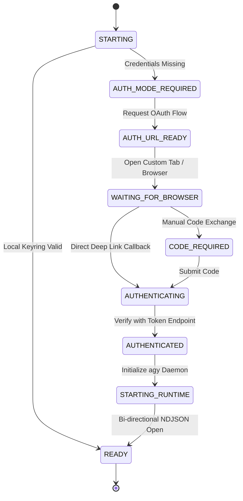

# Antigravity Mobile

[](https://developer.android.com)
[-blue.svg)](https://developer.android.com)
[-orange.svg)](https://developer.android.com/ndk)
[](https://gradle.org)
[](https://developer.android.com/ndk/guides/abis)
[](.github/workflows/ci.yml)

**Antigravity Mobile** is a native Android controller and terminal interface for [Google Antigravity](https://www.antigravity.google/docs/) running inside an existing ARM64 Linux userspace under Android [PRoot](https://github.com/LinuxDroidapp/proot).

Android acts strictly as the **UI, terminal, and controller layer**. The Linux userspace is **authoritative**—it owns projects, files, Git repositories, credentials, agent sessions, subagents, and runtime state.

---

## Table of Contents

- [Architectural Philosophy](#architectural-philosophy)
- [System Architecture](#system-architecture)
- [Technical Specifications & Compatibility](#technical-specifications--compatibility)
- [Repository Structure](#repository-structure)
- [Authentication Lifecycle](#authentication-lifecycle)
- [Headless Stream Protocol](#headless-stream-protocol)
- [Native Terminal & PTY Subsystem](#native-terminal--pty-subsystem)
- [Prerequisites](#prerequisites)
- [Building & Compiling](#building--compiling)
- [Continuous Integration (CI/CD)](#continuous-integration-cicd)
- [Artifact Retention Policy](#artifact-retention-policy)
- [Device Deployment & Runtime Integration](#device-deployment--runtime-integration)
- [Security & Sandboxing](#security--sandboxing)
- [References & Upstream](#references--upstream)

---

## Architectural Philosophy

Traditional mobile developer tools often attempt to re-implement developer workflows inside the restrictive Android application sandbox. Antigravity Mobile adopts an authoritative Linux architecture inspired by [LinuxDroid](https://github.com/LinuxDroidapp/LinuxDroid):

```
+-------------------------------------------------------------------------+
|                              Android Layer                              |
|                                                                         |
|  +-----------------------+   +-------------------+   +---------------+  |
|  | Jetpack Compose UI    |   | Native PTY JNI    |   | Foreground    |  |
|  | (Material 3 Screens)  |   | Bridge (C11)      |   | Service       |  |
|  +-----------+-----------+   +---------+---------+   +-------+-------+  |
+--------------|-------------------------|---------------------|----------+
               | Local IPC (PTY / Unix Sockets / NDJSON)       |
+--------------v-------------------------v---------------------v----------+
|                        PRoot Execution Sandbox                          |
|  +-------------------------------------------------------------------+  |
|  | ARM64 Linux Userspace (Debian / Ubuntu Rootfs)                    |  |
|  |                                                                   |  |
|  |  +-----------------------+     +-------------------------------+  |  |
|  |  | Headless agy CLI      |     | Developer Toolchain           |  |  |
|  |  | (stream-json runtime) |     | (git, compilers, runtimes)    |  |  |
|  |  +-----------+-----------+     +---------------+---------------+  |  |
|  |              |                                 |                  |  |
|  |  +-----------v-----------+     +---------------v---------------+  |  |
|  |  | Linux Secret Keyring  |     | Workspace Projects & Files    |  |  |
|  |  | & Active Auth Tokens  |     | (~/Projects/*)                |  |  |
|  |  +-----------------------+     +-------------------------------+  |  |
|  +-------------------------------------------------------------------+  |
+-------------------------------------------------------------------------+
```

### Key Principles

1. **Linux is Authoritative**: Workspace files, Git history, local credentials, and the `agy` process state remain inside the Linux userspace. Android never mirrors or clones Git repositories into private app storage.
2. **Real PTY Allocation**: Terminal sessions execute via native POSIX pseudo-terminals (`openpty`, `fork`, `execvp`) rather than pipes, giving tools proper ANSI/VT100 escape codes, terminal sizing (`TIOCSWINSZ`), and interactive job control.
3. **Structured Stream Communication**: For agent interaction, Antigravity Mobile talks directly to the official headless `agy` process using bidirectional newline-delimited JSON (`stream-json`), rather than scraping text from terminal buffers.
4. **Persistent Daemon Lifecycle**: The runtime service runs as an Android Foreground Service (`FOREGROUND_SERVICE_SPECIAL_USE`) so background agent tasks, subagents, and compile jobs do not terminate when switching apps.

---

## Technical Specifications & Compatibility

The project is built against the modern Android platform while maintaining robust backward compatibility across generations of Android devices:

| Component | Target Version | Details |
|---|---|---|
| **Android Compile SDK** | `37` | Compiles against latest Android Platform Target 37 APIs |
| **Android Target SDK** | `37` | Targets Android Platform Target 37 runtime behavior |
| **Android Minimum SDK** | `28` | **Backward compatible** with Android 9.0 (Pie) through Android 15/16/API 37 |
| **Android NDK** | `30` (`30.0.16248370`) | Android NDK r30 LLVM toolchain with C11 standard |
| **Gradle** | `9.7+` (v9.7.1) | Gradle 9.7+ wrapper with instant execution and configuration cache |
| **Android Gradle Plugin** | `9.3.2` | AGP 9.3 series supporting Gradle 9 and target SDK 37 |
| **Kotlin** | `2.3.20` | Kotlin 2.3 series with Compose Compiler plugin |
| **JVM Target** | `17` | Bytecode targeting Java 17 LTS |
| **Target Architecture** | `arm64-v8a` | Native 64-bit ARM execution for Android and PRoot Linux |
| **Native C Standard** | `C11` | Compiled with `-std=c11 -Wall -Wextra -Werror` |

### Backward Compatibility Strategy

- **API 28 (Android 9.0) Baseline**: All core Android capabilities—including foreground services, notification channels, JNI PTY integration, and Custom Tabs—run without breaking on Android 9.0+.
- **Edge-to-Edge & Compose 2026**: Modern Material 3 UI dynamically respects window insets and gesture navigation on newer devices while falling back cleanly on legacy navigation bars.
- **Dynamic NDK Resolution**: The Gradle build allows overriding `ANDROID_NDK_VERSION` via environment variables while defaulting to the official NDK 30 release (`30.0.16248370`).

---

## Repository Structure

```
swift-kalam/
├── .github/
│   └── workflows/
│       └── ci.yml                 # GitHub Actions CI workflow (NDK 30, SDK 37, 1-day artifacts)
├── app/
│   ├── build.gradle.kts           # App module build config (SDK 37, NDK 30, minSdk 28)
│   ├── proguard-rules.pro         # Proguard/R8 optimization rules
│   └── src/
│       └── main/
│           ├── AndroidManifest.xml # Permissions, foreground service & activity declarations
│           ├── cpp/
│           │   ├── CMakeLists.txt # Native CMake build script
│           │   └── pty_bridge.c   # POSIX PTY allocation & JNI bridge implementation
│           ├── java/com/infidelrahul/antigravitymobile/
│           │   ├── MainActivity.kt               # Entrypoint & OAuth URL callback handler
│           │   ├── antigravity/
│           │   │   ├── AntigravityModels.kt      # Stream JSON envelopes & AuthState definitions
│           │   │   └── AntigravityParser.kt      # Resilient kotlinx.serialization NDJSON parser
│           │   ├── runtime/
│           │   │   ├── LinuxRuntimeService.kt    # Foreground service for persistent runtime
│           │   │   └── RuntimeConfig.kt          # PRoot execution arguments & rootfs path
│           │   ├── terminal/
│           │   │   └── NativePty.kt              # JNI external interface for pty_bridge.c
│           │   └── ui/
│           │       ├── AntigravityApp.kt         # Jetpack Compose UI (Tabs, Agent, Terminal)
│           │       └── AppState.kt               # Reactive application state
│           └── res/                              # Android resources (strings, styles, icons)
├── docs/
│   ├── ARCHITECTURE.md            # Architecture principles and boundary documentation
│   ├── AUTH_FLOW.md               # Detailed OAuth authentication state machine
│   ├── BRIDGE_TODO.md             # LinuxDroid runtime bridge integration roadmap
│   └── RESEARCH.md                # 2026 platform research snapshot
├── gradle/
│   └── wrapper/
│       ├── gradle-wrapper.jar     # Gradle wrapper executable archive
│       └── gradle-wrapper.properties # Configured for Gradle 9.7.1
├── vendor/
│   └── proot/                     # Git submodule tracking LinuxDroid PRoot fork
├── build.gradle.kts               # Root Gradle build script (AGP 9.3.2, Kotlin 2.3.20)
├── gradle.properties              # JVM options & AndroidX configuration
├── gradlew                        # Unix Gradle wrapper shell script
├── gradlew.bat                    # Windows Gradle wrapper batch script
├── settings.gradle.kts            # Project settings & dependency resolution repositories
├── THIRD_PARTY.md                 # Upstream licenses and references
└── README.md                      # Comprehensive project documentation
```

---

## Authentication Lifecycle

Antigravity Mobile supports Google Antigravity authentication without ever extracting private tokens into the Android storage.



### Lifecycle Rules

1. **Continuous CLI Process**: The underlying `agy` process is kept running during the entire OAuth cycle. It is never killed prematurely with arbitrary timeouts (e.g. 60 seconds).
2. **Deep Link Callback**: When the browser completes authentication, `MainActivity.onNewIntent()` receives the callback intent and transfers the authorization payload directly to the running session.
3. **Credentials Stay in Linux**: Tokens are committed directly to the Linux secret keyring in the PRoot container.

---

## Headless Stream Protocol

The app interfaces with Antigravity via continuous NDJSON streams:

```bash
agy --input-format stream-json --output-format stream-json
```

### Incoming Events

- **`init`**: Supplies working directory (`cwd`), registered tools, and permission modes.
- **`step_update`**: Real-time incremental deltas (`text_delta`), step execution index, running state (`in_progress`, `done`), and duration.
- **`result`**: Final execution status, full responses, or error diagnostics.

### Outgoing Envelopes

User instructions, tool approvals, and model parameters (`--model`, `--effort`) are passed directly over `stdin` as serialized JSON envelopes.

---

## Native Terminal & PTY Subsystem

The terminal emulator leverages `app/src/main/cpp/pty_bridge.c` to open true POSIX pseudo-terminals:

- **`nativeOpen(command, argv, rows, cols)`**: Calls `openpty()`, sets window size with `struct winsize`, forks child process, executes `setsid()`, sets `TIOCSCTTY`, binds stdio to the slave FD, sets `TERM=xterm-256color` and `COLORTERM=truecolor`, and executes the command via `execvp()`.
- **`nativeResize(fd, rows, cols)`**: Issues `ioctl(fd, TIOCSWINSZ, &w)` whenever the Android screen orientation or virtual keyboard alters screen dimensions.
- **`nativeWrite(fd, data)`** / **`nativeRead(fd, buffer)`**: Asynchronous non-blocking byte transfers between Kotlin coroutines and the PTY master descriptor.

---

## Prerequisites

To build Antigravity Mobile locally, ensure the following are installed:

- **JDK 17 LTS** (OpenJDK / Eclipse Temurin 17)
- **Android SDK** with:
  - Android Platform Target `37` (`platforms;android-37`)
  - Android Build-Tools `35.0.0` or higher
  - Android NDK `30` (`ndk;30.0.16248370`)
  - CMake `3.22.1` or higher
- **Git** with submodule support

---

## Building & Compiling

### 1. Clone with Submodules

```bash
git clone --recurse-submodules https://github.com/InfidelRahul/swift-kalam.git
cd swift-kalam

# Or if already cloned:
git submodule update --init --recursive
```

### 2. Configure Environment

Ensure your environment points to your Android SDK and NDK installations:

```bash
export ANDROID_HOME="/path/to/android-sdk"
export ANDROID_NDK_VERSION="30.0.16248370"
export ANDROID_NDK_ROOT="$ANDROID_HOME/ndk/$ANDROID_NDK_VERSION"
```

### 3. Build with Gradle 9.7+ Wrapper

Compile Debug APK:
```bash
./gradlew assembleDebug --stacktrace
```

Compile Release APK (Unsigned):
```bash
./gradlew assembleRelease --stacktrace
```

Compile All Variants:
```bash
./gradlew assemble --stacktrace
```

Clean Build Artifacts:
```bash
./gradlew clean
```

### Build Outputs

| Variant | Output Location |
|---|---|
| **Debug APK** | `app/build/outputs/apk/debug/app-debug.apk` |
| **Release APK** | `app/build/outputs/apk/release/app-release-unsigned.apk` |

---

## Continuous Integration (CI/CD)

The automated build pipeline is located at [`.github/workflows/ci.yml`](.github/workflows/ci.yml).

### Workflow Capabilities

- **Trigger Matrix**: Automatically runs on every push and pull request to `main` / `master`, and supports manual on-demand execution via `workflow_dispatch`.
- **Reproducible Toolchain**:
  - Automatically provisions JDK 17 (Temurin).
  - Configures Gradle 9.7+ caching via `gradle/actions/setup-gradle@v4`.
  - Installs Android SDK Platform Target `37`, Build Tools `35.0.0`, NDK `30.0.16248370`, and CMake `3.22.1`.
- **Submodule Recursion**: Automatically clones and verifies the `vendor/proot` submodule.
- **Verification**: Asserts the generation and file integrity of both debug and release APK packages.

---

## Artifact Retention Policy

Every build triggered on GitHub Actions uploads compiled APKs via `actions/upload-artifact@v4`:

```yaml
- name: Upload Build Artifacts (Validity: 1 Day)
  uses: actions/upload-artifact@v4
  with:
    name: antigravity-mobile-apks
    path: |
      app/build/outputs/apk/**/*.apk
    retention-days: 1
    if-no-files-found: error
```

> [!IMPORTANT]
> **1-Day Validity**: Artifacts uploaded by CI are set with `retention-days: 1`. They are strictly retained for **24 hours** from completion and automatically purged thereafter. This prevents storage bloat while ensuring fresh test builds are readily available for immediate device validation.

---

## Device Deployment & Runtime Integration

### 1. Install APK on ARM64 Device

Ensure USB debugging is enabled on your Android device (Android 9.0+ / API 28+):

```bash
adb install -r app/build/outputs/apk/debug/app-debug.apk
```

### 2. Runtime Permissions

Upon launch, grant:
- **Notification Permission**: Enables the persistent foreground service notification ensuring the Linux environment remains active.
- **Battery Optimization Exemption**: Recommended to prevent Android OEM battery killers from terminating the PRoot session.

### 3. Pairing with Existing Rootfs

Antigravity Mobile does not provision a Linux distribution itself. Point the runtime config (`RuntimeConfig.kt`) to your existing Linux rootfs containing the official `agy` binary:

```kotlin
val config = RuntimeConfig(
    prootPath = "/data/data/com.infidelrahul.antigravitymobile/files/proot",
    rootfs = "/data/data/com.infidelrahul.antigravitymobile/files/rootfs",
    workingDirectory = "/home/user/Projects/DAntigravity",
    agyPath = "/usr/local/bin/agy"
)
```

---

## Security & Sandboxing

1. **Non-Root Execution**: PRoot virtualizes `chroot`, `mount`, and user IDs using `ptrace` in unprivileged userspace. No root or bootloader unlocking is required.
2. **Foreground Service Special Use**: Declared in `AndroidManifest.xml` under `FOREGROUND_SERVICE_SPECIAL_USE` with `PROPERTY_SPECIAL_USE_FGS_SUBTYPE="Persistent Linux and Antigravity runtime"` in compliance with Android 14+ requirements.
3. **Network Isolation**: Android network permissions (`INTERNET`, `ACCESS_NETWORK_STATE`) bridge transparently to the PRoot userspace for outbound API and package manager operations.

---

## References & Upstream

- [LinuxDroid](https://github.com/LinuxDroidapp/LinuxDroid) — Process/session/runtime reference architecture.
- [LinuxDroid PRoot](https://github.com/LinuxDroidapp/proot) — PRoot fork optimized for Android userspace virtualization.
- [Google Antigravity Documentation](https://www.antigravity.google/docs/) — Official Antigravity documentation and headless CLI guides.
